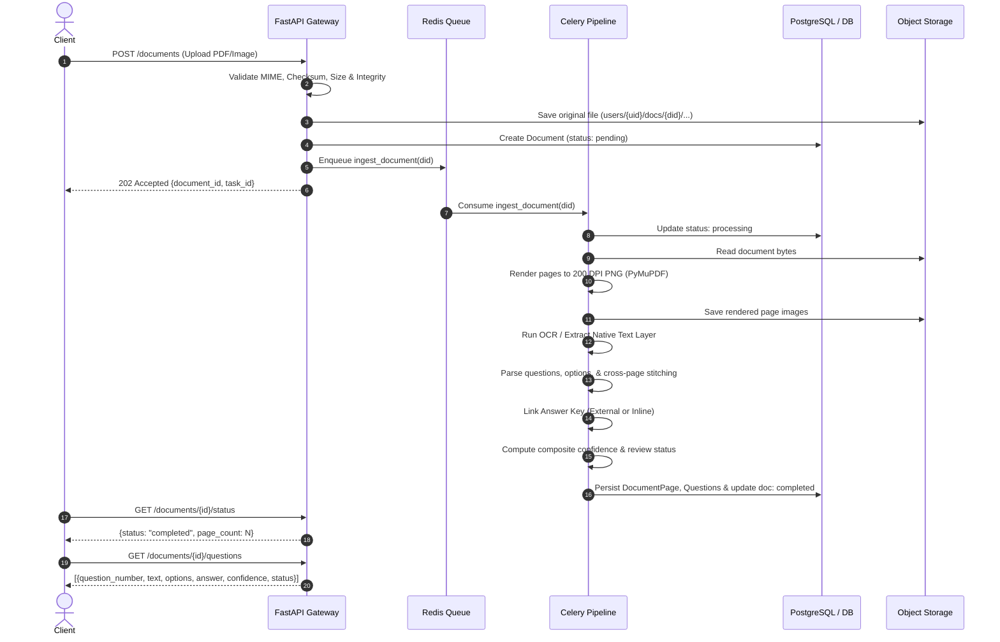

# Pragati Document Intelligence & Question Extraction Service
## Architectural Design & Engineering Specification

### 1. Executive Summary
The Pragati Document Intelligence Service is an asynchronous, high-throughput extraction platform designed to ingest academic question papers and answer keys across heterogeneous formats (digitally generated PDFs, scanned documents, and raw images). It renders high-fidelity page images, extracts structured questions with multiple-choice options, merges questions that cross page boundaries, links answer keys, calculates composite confidence scores, and flags uncertain items for human review.

---

### 2. High-Level System Architecture

```text
                               ┌────────────────────────┐
                               │   Client Application   │
                               └───────────┬────────────┘
                                           │ HTTPS (Bearer JWT)
                                           ▼
┌─────────────────────────────────────────────────────────────────────────────────┐
│                           FastAPI Gateway (Port 8000)                           │
│  - JWT Bearer Authentication & RBAC (Admin / User Isolation)                   │
│  - File Sniffing & Stream Validation (MIME, Extension, Size, Magic Bytes)      │
│  - Asynchronous Task Dispatcher & Polling Endpoints                             │
└───────────────────────┬───────────────────────────────┬─────────────────────────┘
                        │ Enqueue Task                  │ Direct Read / Stream
                        ▼                               ▼
             ┌─────────────────────┐         ┌───────────────────────┐
             │ Redis Broker/Result │         │  PostgreSQL Database  │
             └──────────┬──────────┘         │  (Metadata, Schemas,  │
                        │                    │   Questions, Warnings)│
                        ▼                    └───────────▲───────────┘
             ┌─────────────────────┐                     │
             │   Celery Workers    │─────────────────────┘
             │ (ingest_document)   │
             └──────────┬──────────┘
                        │ Persist Original & 200 DPI Page Renders
                        ▼
             ┌─────────────────────┐
             │    Object Storage   │
             │ (Local / S3 Store)  │
             └─────────────────────┘
```

> **Pipeline Execution Architecture**:
> A single Celery task (`ingest_document`) runs the full pipeline synchronously inside one worker. `dispatch_processing()` checks broker reachability with a 200ms socket test and falls back to in-process execution if Redis is unavailable, which keeps local dev and tests frictionless while supporting worker decoupling in production.

#### End-to-End Sequence Flow


---

### 3. Data Model & Entity Relations

```text
  +------------------+         +-------------------+
  |      User        | 1     * |   DocumentGroup   |
  |------------------|<------->|-------------------|
  | id (UUID)        |         | id (UUID)         |
  | email (UNIQUE)   |         | owner_id (FK)     |
  | password_hash    |         | name              |
  | role             |         | created_at        |
  +--------+---------+         +---------+---------+
           | 1                           | 1
           |                             |
           | *                           | *
  +--------v---------+                   |
  |     Document     |                   |
  |------------------|                   |
  | id (UUID)        |                   |
  | owner_id (FK)    |                   |
  | group_id (FK)    |<------------------+
  | role             |
  | filename, mime   |
  | size_bytes       |
  | storage_key      |
  | status, error    |
  | page_count       |
  +--------+---------+
           | 1
           +-----------------------------+
           | *                           | *
  +--------v---------+          +--------v----------+
  |   DocumentPage   |          |     Question      |
  |------------------|          |-------------------|
  | id (UUID)        |          | id (UUID)         |
  | document_id (FK) |          | document_id (FK)  |
  | page_number      |          | group_id (FK)     |
  | image_key        |          | question_number   |
  | raw_text         |          | question_text     |
  | ocr_confidence   |          | options (JSONB)   |
  | rotation_deg     |          | question_type     |
  +------------------+          | answer, source    |
                                | answer_confidence |
                                | source_pages[]    |
                                | confidence (0..1) |
                                | status            |
                                | warnings (JSONB)  |
                                +-------------------+
```

---

### 4. Processing Pipeline Details

#### Stage 1 — Ingestion & Page Decomposition
- **Integrity Validation**: Evaluates file headers and structures using `fitz.open` (PDF) and `PIL.Image.open` (Raster). Rejects corrupted files with `400 Bad Request`.
- **Text Density Analysis**: Digital PDFs undergo text-layer extraction. If a page contains fewer than 15 words across its canvas, it is tagged `is_scanned = True`.
- **High-Resolution Page Rendering**: PyMuPDF renders pages at 200 DPI (`zoom = 200 / 72.0 = 2.77x`). This ensures high-contrast lines for OCR and provides a readable PNG for manual human verification.

#### Stage 2 — OCR & Layout Normalization
- **Tesseract Engine**: Runs with auto-orientation and script detection (OSD / PSM 1).
- **Confidence Computation**: Extracts word-level confidence metrics (`conf / 100.0`) and calculates the page-level arithmetic mean.
- **Provider Interface**: `BaseOCRProvider` allows zero-code-change switching to `AzureDocumentIntelligenceProvider` or `OpenAIVisionOCRProvider` via the `OCR_PROVIDER` environment variable.

#### Stage 3 — Question & Option Extraction
- **Regex Heuristic Engine**:
  - Question start: `^\s*(?:Question\s+|Q\.?\s*)?(\d{1,3}[a-z]?|[IVXLCDM]{1,6})[\.\:\)\-]\s+(.*)$`
  - Option start: `^\s*(?:\(([A-Da-d1-4])\)|([A-Da-d1-4])[\.\)])\s+(.*)$`
- **Cross-Page Stitching**:
  When page $P$ ends with an open question statement and page $P+1$ begins with options or continuation sentences without a new question number, lines are merged into the pending question block. The item is marked with:
  - `source_pages: [P, P+1]`
  - `warnings: ["split_across_pages"]`

#### Stage 4 — Answer Key Matching
- **Cross-Document Association**: Documents belonging to the same `group_id` where one document has `role='answer_key'` and another has `role='question_paper'` are cross-linked.
- **Normalization**: Strips noise characters (`1a` $\to$ `1a`, `Q1.` $\to$ `1`, `Ans 2:` $\to$ `2`).
- **Conflict Handling**: Multiple conflicting answers in the key for a single question flag `ambiguous_answer_match` and set `answer_source = 'none'`.

#### Stage 5 — Confidence & Status Scoring
The composite confidence score balances OCR quality, structural integrity, and answer key presence:

$$\text{confidence} = 0.5 \times \text{ocr\_conf} + 0.3 \times \text{structure\_score} + 0.2 \times \text{answer\_score}$$

- $\text{structure\_score} = 1.0$ (clean parse) or $0.4$ (warnings present).
- $\text{answer\_score} = \text{answer\_conf}$ (default $0.5$ if no answer key was uploaded).

**Classification Rules:**
- `confidence >= 0.75` and no review-forcing warnings $\longrightarrow$ `"ok"`
- `confidence >= 0.45` $\longrightarrow$ `"partial"`
- `< 0.45` or critical warning (`low_ocr`, `missing_options`, `low_content`) $\longrightarrow$ `"needs_review"`

---

### 5. Documented Trade-offs & Engineering Decisions

1. **Tesseract vs. Managed Cloud OCR**:
   - *Trade-off*: Tesseract is 100% free, private, self-hostable, and air-gapped, but possesses lower accuracy on complex handwriting.
   - *Decision*: Adopted Tesseract as the default provider with an extensible provider interface (`BaseOCRProvider`), enabling seamless activation of Azure Document Intelligence or OpenAI Vision via `.env`.

2. **Heuristic Rule-Based Parsing vs. Pure LLM Parsing**:
   - *Trade-off*: Pure LLM parsing incurs token costs, rate limits, latency (2–5s per page), and non-deterministic behavior.
   - *Decision*: A high-speed, deterministic regex state machine serves as the primary parser. An optional LLM fallback hook is provided for pages where heuristic confidence falls below acceptable thresholds.

3. **Identifier Normalization vs. Semantic Matching**:
   - *Trade-off*: Matching by question number fails if sections restart numbering without explicit headers (e.g. two "Question 1"s).
   - *Decision*: In ambiguous cases, the system refrains from guessing and flags `ambiguous_answer_match` or `unmatched_answer`, forcing human reviewer verification per strict safety standards.

4. **Page-Level Storage vs. Bounding Box Cropping**:
   - *Trade-off*: Storing individual cropped snippets for every question increases file I/O and storage complexity.
   - *Decision*: Store full 200 DPI page images along with bounding boxes in JSON metadata. The UI can display highlighted overlays directly on the source page image (`GET /documents/{id}/pages/{n}?as_image=true`).

5. **Storage Path Safety**:
   - Absolute paths are strictly resolved within the designated `STORAGE_ROOT`. Attempts at directory traversal (e.g., `../../etc/passwd`) are intercepted and rejected with a `ValueError`.
